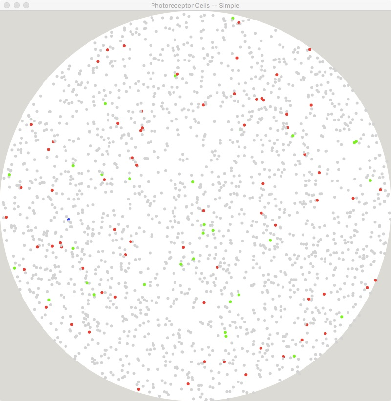
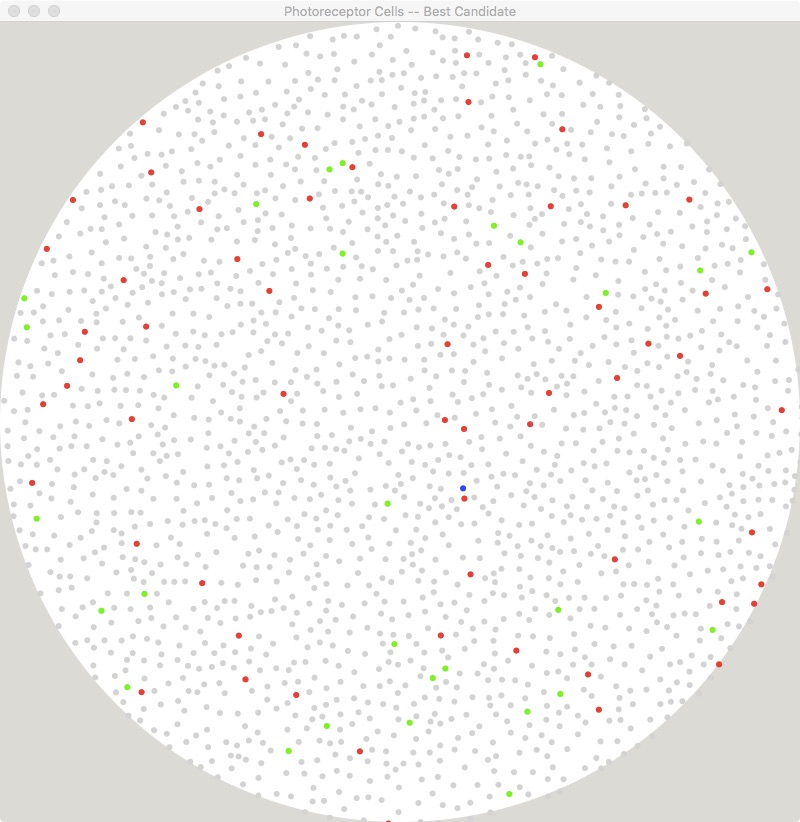
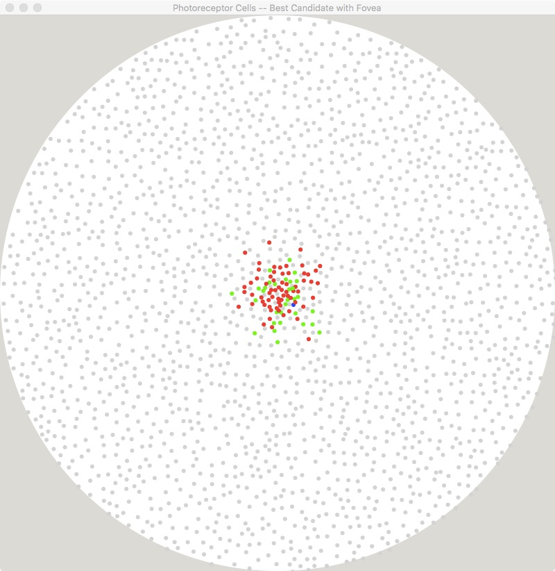

#  CSCI 1100 Gateway to Computer Science

### Fall 2022

Robert Muller - Boston College

------

## Problem Set 3 : The Best Candidate Algorithm

### 15 Points

### Due Friday October 7, 2022, Midnight

**Step 0**: This is a pair problem set. Find a partner to work with. Your partner can be from either section. If you don't know anyone to partner with, you can use [Piazza's partner finding tool](https://piazza.com/class/ke7uxpkwqw643p?cid=5) or you can ask a course staffer to help you find one. It's important to do this as soon as possible, hopefully today.

> NB: For this problem set, your final commit message must include both partners' full names and whether or not you and your partner did the extra credit problem. As in
>
> Final: Robert Muller, Lyn Turbak
>
> or
>
> Final: Robert Muller, Lyn Turbak -- Extra Credit
>
> The TA staff will mark off for submissions of team psets with commit messages missing the required information.

---

This problem set is concerned with the problem of randomly distributing points on a 2D plane. As a special case, we'll considered the distribution of photoreceptor cells on the [retina](https://en.wikipedia.org/wiki/Retina). Photoreceptor cells include both the luminance sensing [rod](https://en.wikipedia.org/wiki/Rod_cell) cells and the red, green and blue color sensing [cone](https://en.wikipedia.org/wiki/Cone_cell) cells. It turns out that the human retina contains about 120 million rod cells and about 6 million cone cells. Of the 6 million cone cells, roughly 63% sense red light, roughly 33% sense green light with only 3% sensing blue light. (If you're inclined, you can view an interesting lecture on the [evolution of trichromatic color vision](https://techtv.mit.edu/videos/16541-the-evolution-of-trichromatic-color-vision).)

This is a two part animation problem. Both parts start by displaying an image of a white circle of radius 400. The circle represents a human retina, initially it hosts no photo-receptor cells at all. In the course of the animation, 1000 photo-receptor cells will be added to the surface of the retina. On each clock-tick, a new randomly generated photo-receptor cell should be added to the retinal surface. The random generation should respect the proportions of the photo-receptor types specified above. In addition to a cell type, each cell should have random x and y coordinates specifying where the cell is placed on the circular retinal surface.

In part 1 of the problem set, the photo-receptor cells are placed randomly, with whatever x and y values happen to be generated by the random number generator. This will lead to a poor/uneven distribution of cells on the surface. In part 2, better distribution is achieved using the *best candidate algorithm*.

|  |  |
| :------------------------------------: | :-------------------------------------------: |
|       Simple Random Distribution       |         The Best Candidate Algorithm          |

#### Representing Photo-Receptor Cells

In order to distinguish between the different types of photo-receptor cells, it's handy to define some symbols representing the *type* of the cell. These symbols can be defined as global constants near the top of your program.

```python
# Cell Types
Rod = 0
BlueCone = 1
GreenCone = 2
RedCone = 3
```

Then we might consider representing a photo-receptor cell as a 3-tuple:

```python
(cell-type, x, y)
```

For example, we might have `(BlueCone, 100, 200)`.

#### Randomly Generating Photo-Receptor Cells

If we want to randomly generate cone cells in the correct proportions, i.e., 3% blue, 33% green and 66% red, we can generate a random number between 0 and 1.0 and divide the range of possible answers according to the required proportions.

```
0     .                                                .63                         .97   1.0
+-------------------------------------------------------+---------------------------+------+
                           red                                        green           blue
```

In Python, we might write:

```python
# makeConeCell : unit -> cone-cell
def makeConeCell():
  coneType = random.random()
  if coneType > .97:             # 3% are blue cones
    return BlueCone
  else:
    if coneType > .63:           # 33% are green cones
      return GreenCone
    else:
      return RedCone             # 63% are red cones
```

and then for rods vs cones, we might write:

```python
# makePhotoReceptorCell : unit -> photo-receptor-cell  
def makePhotoReceptorCell():
  rodOrCone = random.random()
  if rodOrCone < .95:
    return Rod                   # 95% of photo-receptor cells are rod cells
  else:
    return makeConeCell()        # 5% of photo-receptor cells are cone cells
```

The x and y values for a cell should also be generated randomly. **Some care must be taken to ensure that the chosen x and y values cause the cell to be placed on the circular retinal surface rather than off the circle on the gray background area.**

#### Rendering Photo-Receptor Cells

A photo-receptor cell `(cell-type, x, y)` can be rendered as an appropriately colored circle image with a small radius. The placement of the small circle on the background retinal surface would be determined by its x and y components.

#### Part 1: Simple Random Distribution

For Simple random distribution, exactly one new cell `(cell-type, x, y)` is generated on each clock tick. The cell is placed on the surface at `(x, y)`. This simple algorithm leaves something like the image below. Note that the surface has many cells that are clumped together with other areas being completely free of cells.


#### A Model

When thinking about a suitable model for an animation, we ask: What is changing over the course of the animation? Well, on each clock-tick we're adding one more cell to the retinal surface *and* we're decrementing the number of cells remaining to be added. When this number reaches 0, the animation ends. So two things are changing during the course of the animation and therefore a 2-tuple `(n, image)` would probably be a reasonable model, where `n` is the number of cells remaining to be added and `image` is the partially completed image of the retina.

Of course, the `tickUpdate` function provided to `Animate.start` will work with both `n` and `image`. The `stopWhen` function provided to `Animate.start` will be interested only in the value of `n` and the `view` and `viewLast` functions provided to `Animate.start` will both be interested only in `image`. You may wish to experiment with different clock rates to achieve a smooth flow.

### Part 2: The Best Candidate Algorithm

The best candidate algorithm is a repetitive algorithm that maintains the set of cells`{p1, ..., pk}` that have already been placed on the surface. In each cycle through the iterations of the algorithm, i.e., on each clock tick, a set of j candidate points `{c1, ..., cj}` is generated. Exactly one of these candidates will be selected to join the list of random cells on the retinal surface. In particular, for each candidate `ci`, the nearest neighbor in `{p1, ..., pk}` is found. The candidate with the greatest distance to it's nearest neighbor is taken to be the best; it joins the list of random points and the other candidates are discarded.


Implement the best candidate algorithm to simulate the placement of 1000 photoreceptor cells on a circular retina. Your implementation should be a [model-view-update](https://dennisreimann.de/articles/elm-architecture-overview.html) application that renders the set of points generated so far on each clock tick of the `Animate.start` function.

#### A Model

What is changing in this animation? Well as in the simple system in Part 1, we have both the number of cells remaining to be added `n` and we have the changing `image`. But in this more sophisticated system, our new choice is chosen by comparing distances to previously placed cells. This means that our model will also need to include all of the previously placed cells. A 3-tuple should do:

```
(n, image, already-placed-cells)
```

where `already-placed-cells` is a **list** of cells. When the model is received by the `tickUpdate` function, it uses the already placed cells in the process of choosing the best candidate cell to add. The `view`, `viewLast`,  `stopWhen` functions can be just as they were in Part 1.

### Simulating the Fovea - 2 Points

The [fovea centralis](https://en.wikipedia.org/wiki/Fovea_centralis) is a small pit located near the center of the retina composed of closely packed cone cells. It is located in the center of the [macula lutea](https://en.wikipedia.org/wiki/Macula_lutea). The fovea is responsible for sharp central [vision](https://en.wikipedia.org/wiki/Visual_perception) (also called [foveal vision](https://en.wikipedia.org/wiki/Foveal)), which is necessary in humans for activities for which visual detail is of primary importance, such as [reading](https://en.wikipedia.org/wiki/Reading_(activity)) and driving. Approximately half of the [nerve](https://en.wikipedia.org/wiki/Nerve) fibers in the [optic nerve](https://en.wikipedia.org/wiki/Optic_nerve) carry information from the fovea, while the remaining half carry information from the rest of the retina.

Modify the best candidate algorithm to simulate the concentration of cone cells in the fovea. Your algorithm should probabilistically place the cone cells near the center of the image but the cone cells should be separated from existing cells (rods or cones) using the basic best candidate algorithm.



#### Submitting Your Work

As before, when you've completed edits, you can try your code out by firing up a unix shell and compiling and running the code by typing:

```ocaml
cd src/best
python3 bestCandidate.py
```
Once the code works to your satisfaction, use the `git push` command to upload **one copy** of your team's work to your master repo on GitHub.

```bash
> git add .
> git commit -m "Final: Robert Muller, Lyn Turbak"
> git push
```

Don't forget! You need both names for the final commit message.

You're done!
